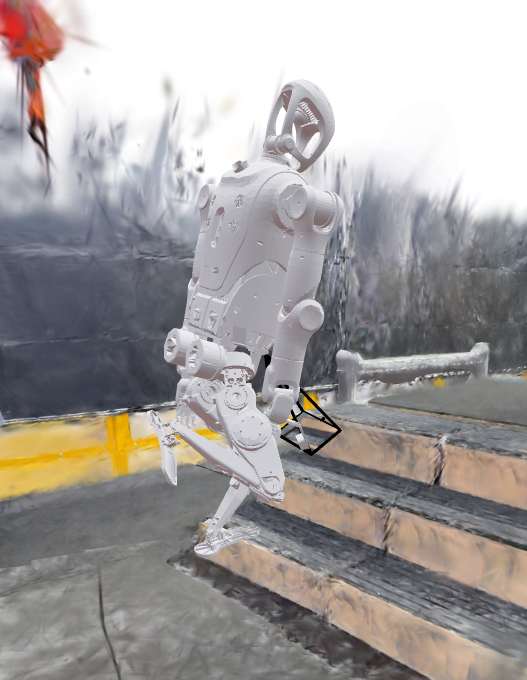

<h1 align="center">GaussGym</h1>

<p align="center">
  <a href="https://arxiv.org/pdf/2510.15352" style="text-decoration: none;">
    
  </a>
  <a href="https://escontrela.me/gauss_gym/" style="text-decoration: none;">
    
  </a>
  <a href="https://huggingface.co/collections/escontra/gauss-gym-datasets-68f1545f33691c8cb43a55ff" style="text-decoration: none;">
    
  </a>
  <a href="https://escontrela.me/gauss_gym/#try-it-yourself" style="text-decoration: none;">
    
  </a>
</p>
<p align="center">
  
</p>

---

# Release TODO:

- [ ] Release multi-gpu/node training
- [ ] Provide deployment code
- [ ] Provide pre-trained policies
- [x] [Oct 21, 2025] Initial code and data release

# Installation

Clone `gauss_gym` and install.
```bash
git clone https://github.com/escontra/gauss_gym.git
cd gauss_gym
bash setup_dev.sh
```

This will create a new `gauss_gym` conda environment under `~/.gauss_gym_deps`, which can be activated with:

```bash
source ~/.gauss_gym_deps/miniconda3/bin/activate gauss_gym
```

# Training

Configs have been provided for:
- `a1`
- `a1_vision`
- `go1`
- `go1_vision`
- `t1`
- `t1_vision`
- `anymal_c`
- `anymal_c_vision`

Configs can be created under `gauss_gym/envs` and require updating the registry at `gauss_gym/envs/__init__.py`.

**Note:** Only a1 and t1 configs have been verified on hardware.

Train policies with:

```bash
gauss_train --task=t1 --env.num_envs 2048
```

This will automatically download the scenes from huggingface (requires HF login) and begin training. The number of scenes and their sources is configured in `terrain.scenes`. Use `*_vision` configs to train policy from pixels.

Training will launch a viser server at `localhost:8080` which can be used to visualize various aspects of the policy and scene. Use `--runner.share_url True` to start a tunnel and share this URL with others! Blind policies don't render gaussians by default. To force gaussian visualization, use `--env.force_renderer=True`.

All values in the `config.yaml` can be modified from the command line. Logging to wandb during training can be enabled with: `--runner.use_wandb True`.

# Evaluation

Evaluate policies with: `gauss_play --runner.load_run=<RUN_NAME>`, where `<RUN_NAME>` can be:
  - the name of the run in `logs/`.
  - the wandb run name: `--runner.load_run=wandb_t1_<WANDB_RUN_NAME>` (this will automatically download the latest checkpoint from huggingface)
  - the wandb run id: `--runner.load_run=wandb_id_<WANDB_ID>`
  - a wandb run id pointing to another project: `--runner.load_run=wandb_id_<WANDB_ID>:<WANDB_PROJECT>`
  - a wandb run id pointing to another project/entity: `--runner.load_run=wandb_id_<WANDB_ID>:<WANDB_PROJECT>:<WANDB_ENTITY>`

# Adding your own environment with your iPhone/Android + Polycam:

1. Download [`Polycam`](https://poly.cam/)
2. Use Polycam in "Space" mode to capture scene.
3. Process the data in the Polycam app. Export "Raw Data" and "GLTF" from the app. Place the unzipped contents in <POLYCAM_PATH> and rename the `*.glb` file to `raw.glb`.
  - **Note:** Exporting "Raw Data" may require the upgraded version of the app.
4. Create the nerfstudio conda environment with `bash build/environments/nerfstudio/setup_dev.sh`
  - This will create a nerfstudio environment in `~/.ns_deps`. Which you can activate with: `source ~/.ns_deps/miniconda3/bin/activate ns`
5. With the `ns` conda environment active, train a gaussian splat with `bash scene_generation/iphone/polycam_scenes.sh <POLYCAM_PATH>`
6. Generate environment meshes for the scene with: `python scene_generation/generate_mesh_slices.py --config=scene_generation/configs/polycam.py --config.load_dir=<POLYCAM_PATH>`
7. Train/evaluate a policy in your scene with: `--terrain.scenes.iphone_data.repo_id=local:<POLYCAM_PATH>`. You can also add a new entry to the `terrain.scenes` of the config using your custom local or huggingface path.

# Config structure

Configs for each environment are located in `gauss_gym/envs/*/config.yaml`, and specify setting for both the environment and learning. The main aspects in the config are:
  - `env`: Environment configs.
  - `observations`: Policy, critic, and image encoder observations, latency, noise, and delay.
  - `symmetries`: Observation symmetry as used by [Mittal et al.](https://arxiv.org/abs/2403.04359)
  - `terrain`: Terrain configuration, including `terrain.scenes`, which specifies number of scenes to load and from where (e.g. HF).
  - `init_state`: Robot state initialization.
  - `control`: Robot control parameters, such as stiffness and damping.
  - `asset`: URDF and robot information, including termination links and torque clipping.
  - `domain_rand`: Domain randomization configuration.
  - `termination`: Termination conditions
  - `commands`: Task specification and parameters.
  - `rewards`: Reward configuration.
  - `sim`: Simulator configuration.
  - `image_encoder`, `policy`, `value`: Network parameters.
  - `algorithm`: Learning configuration.
  - `runner`: Training, logging, checkpointing params.


# 乐聚S45开发测试
支持显式指定脚的刚体名：在 legged_robot.py 增加 cfg['asset']['feet_names'] 优先逻辑（不再依赖模糊的子串匹配）。  
修正 S45 视觉配置以匹配 URDF：更新 config_vision.yaml  
asset.file 指向 biped_s45.urdf  
asset.base_link_name: base_link  
asset.camera_link_name: zhead_2_link  
asset.feet_names: ['leg_l6_link','leg_r6_link']（每脚一个刚体）  
init_state.default_joint_angles 换成 URDF 里的 28 个 revolute joint（全 0 起步）  
control.stiffness/damping 改成用 leg_ / zarm_ / zhead_ 覆盖全部 DOF（避免 PD gain 未定义报错）  
去掉观测里的 GAIT_PROGRESS（LeggedRobot 没有 phase）  
关闭 algorithm.symmetry_augmentation（暂不需要对称映射）  
关掉 domain_rand.dof_damping_ankles（原来是 T1 的 ankle_names）  
把 T1 专属奖励项 t1_pose/feet_phase/feet_distance 的 scale 置 0，避免 _reward_* 不存在导致崩溃  
注册任务名：在 __init__.py 增加 biped_s45 / biped_s45_vision（当前两者都指向同一个 config_vision.yaml，确保用 --task=biped_s45 也能直接跑）。    

1) 训练代码侧（让力矩限制等生效）  
在 legged_robot.py 的 _process_dof_props() 里新增支持：  
control.effort_limit：按关节名（优先精确匹配，其次子串匹配）覆盖 DOF 的 effort，并同步更新 self.torque_limits（用于训练时 motor_clip_torque 的 torque clip、以及动作空间边界计算等）。  
control.velocity_limit：同样方式覆盖 DOF 的 velocity，并同步 self.dof_vel_limits。  
asset.armature_map：在未启用 armature 随机化时，按关节名覆盖 DOF 的 armature。  
兼容性：原来的 control.torque_limits（标量或 list）仍然可用；如果配置了 control.effort_limit，它会作为更细粒度的覆盖方式。  
2) 重写 biped_s45/config_vision.yaml（对齐 Kuavo 配置）   
文件：config_vision.yaml  
关键变更：  
init_state.pos 改为 0.9（对齐 Kuavos46_CFG）  
init_state.default_joint_angles 保持给的腿部初始姿态（-0.27/0.52/-0.3）  
control.stiffness/damping 改成逐关节（完全照 Kuavo 表里的数）  
新增 control.effort_limit / control.velocity_limit：逐关节填入 Kuavo 的 effort/velocity limit  
新增 asset.armature_map：逐关节填入 Kuavo 的 armature  
将 domain_rand.dof_armature_ig_property.apply 设为 False（否则会覆盖设定的 armature_map）  
删除了遗留的 T1 symmetries: 整段（S45 不适用；且这里 symmetry_augmentation 本来就是 False）    

改动文件：sensors.py  
改动点：MeshHeightSensor.__init__  
现在会先尝试从有效的 foot collision mesh 计算采样点  
如果所有 foot mesh 都为空/无顶点/计算失败，则自动回退用 cfg.asset.feet_edge_pos 作为采样点（再不行就用 (1,3) 的零点）  
这样就不会再在 compute_mesh_ray_points -> bounds[0] 处崩溃  

LeggedRobot 会无条件读取 cfg['asset']['hip_link_names'] 来创建 hip_height_raycaster，而 biped_s45 的 config_vision.yaml 里缺这个字段，所以触发 KeyError: 'hip_link_names'。  
已修复配置：  
修改文件：config_vision.yaml  
新增字段（在 asset: 下）：  
hip_link_names: ['leg_l1_link', 'leg_r1_link']  
说明：  
URDF 里 leg_*1_joint 是与 base_link 相连的第一段（定义为 hip roll/yaw/pitch 的起点），对应的 child link 就是 leg_*1_link，用它们做 “hip 高度射线” 最合理。  

## 1.12 固定头部角度  
代码改动：legged_robot.py  

新增 control.exclude_action_dof_names：从 self.dof_names 里按名字/前缀匹配排除 DOF，self.num_actions 自动变小  
step() 里把 actions (num_actions) 展开成 dof_act (num_dof)，被排除的 DOF 的 action 恒为 0 ⇒ 目标就是 default_joint_angles  
torques/substep_torques/last_torques 改为 始终按 num_dof 分配，避免 action 维度变小后喂给 IsaacGym 的力张量维度错误  
在 config_vision.yaml 修改  

固定头部且不作为 action 输出：  
control.exclude_action_dof_names: ['zhead_1_joint', 'zhead_2_joint']  
低头（通过默认角度实现，action=0 会一直追这个角度）：  
init_state.default_joint_angles.zhead_2_joint: -0.35      
  
ImageEncoderWrapper：  
Runner 会把 self.env 包一层 wrappers.ImageEncoderWrapper(...)，负责在 reset/step 时把IMAGE_ENCODER_LATENT（key 名就是 image_encoder）注入到 policy/critic obs dict。  
如果在测试里用了“原始 env”的 env.reset()/env.step()（而不是 runner.env.reset()/runner.env.  step()），那 obs['policy'] 里就会缺 image_encoder，从而触发 KeyError。  
修正方式：smoke test 里一律用 runner.env.reset()（或直接走 runner.predict(...)）。  


## 1.13 配置腰部相机  
直接在urdf中修改腰部相机pitch角，自带的rpy offset有问题  

## 1.14 
#### 步态正弦信号
GAIT_PROGRESS 已存在：gauss_gym/utils/observations.py:gait_progress() 返回 [sin(phase), cos(phase)]  
已在 config_vision.yaml 把 GAIT_PROGRESS 加进 policy 和 critic 的 observations 列表  
### 新增“脚叉开惩罚”reward  
新增 BipedS45._reward_feet_splay(splay_threshold)：超过阈值的左右脚横向间距才惩罚  
配置里新增：  
feet_splay.scale: -0.2  
feet_splay.splay_threshold: 0.10  
并把原来会“惩罚脚并拢”的 feet_distance.scale 置为 0.0 避免冲突（因为 _reward_feet_distance 是“脚距小于阈值返回 1”，原来给了负权重会反着来）   
### 修改跳跃惩罚  
_reward_no_fly

## Play biped_s45

使用训练输出的 `logs/` 目录中的 run 来回放（与其它任务一致）：

```bash
# 指定要回放的 run
gauss_play --runner.load_run=<BIPED_S45_RUN_NAME> --sim_device=cuda:1 --rl_device=cuda:1 --headless=False --env.num_envs 1

# 或者自动选择最近一次 biped_s45 的 run
gauss_play --task=biped_s45 --sim_device=cuda:1 --rl_device=cuda:1 --headless=False --env.num_envs 1   
```  
resume 训练
```bash
gauss_train --task=biped_s45 --headless=True --env.num_envs 512 --sim_device=cuda:1 --rl_device=cuda:1  --runner.resume=True   --runner.load_run=biped_s45_2026-01-14-13-49-44   --runner.checkpoint=10877 
  ```  
  
## 视觉穿模” 
根因在 biped_s45_waist_cam.urdf 的脚部 collision box 放得太高，不是 PhysX 参数差异：t1 和 biped_s45 的 sim/physx、dt/substeps/iterations 基本一致。  
S45 足底网格（l_foot_roll.STL/r_foot_roll.STL）的最低点在 -0.0595  
z≈−0.0595（用 trimesh 读了 bounds）  
但 biped_s45_waist_cam.urdf 里 leg_*6_link 的 collision box 原来中心在 z=0、厚度 0.04，底面只到 z=-0.02  
⇒视觉网格会比碰撞体“多伸出去”约 4cm，在某些姿态/接触点（尤其没踩到 toe/heel 小球时）看起来就像脚陷进地里   
在 biped_s45_waist_cam.urdf 把左右脚的 collision box 下移到 z=-0.0395，使 box 底面正好到 z=-0.0595，与网格足底对齐。  

## TODO  
走路太不像人了。缝AMP
 

gauss_train --task=biped_s45 --sim_device=cuda:1 --rl_device=cuda:1 --headless=True --env.num_envs 512  
## 1.15 
得加角度限制
